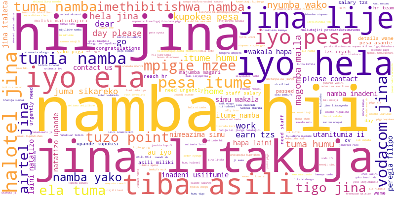
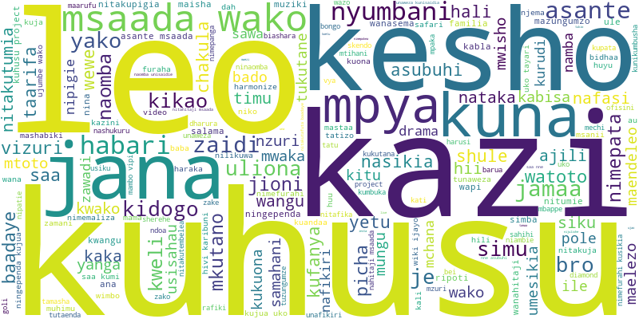

# Swahili SMS Scam Detection

## 📌 Overview
This project aims to detect scam messages in Swahili SMS using Natural Language Processing (NLP) techniques. The dataset contains SMS messages labeled as either **"scam"** or **"trust"**. The project involves data preprocessing, model training, and evaluation to achieve accurate scam detection.

---

## 📂 Repository Structure
```
├── data/                   # Dataset and preprocessed data
├── models/                 # Saved models and tokenizers
├── notebooks/              # Python scripts for preprocessing, modeling, and evaluation
│   ├── preprocessing.py    # Clean and preprocess the dataset
│   ├── baseline_model.py   # Train a baseline model (TF-IDF + Logistic Regression)
│   └── transformer_model.py# Fine-tune a transformer model (AfroXLMR)
├── reports/                # Reports and visualizations
│   ├── visualizations/     # Word clouds and other visualizations
│   └── findings.md         # Key insights and recommendations
├── test_model.py           # Script to test the saved model
├── README.md               # Project documentation
└── requirements.txt        # Python dependencies
```

---

## 📊 Dataset
The dataset used in this project is the **Swahili SMS Detection Dataset**, containing messages labeled as **"scam"** or **"trust"**. You can download it from [Kaggle](https://www.kaggle.com/datasets/henrydioniz/swahili-sms-detection-dataset).

---

## ⚙️ Setup
### 1⃣ Clone the repository
```bash
git clone https://github.com/Mohameddek1/swahili-sms-scam-detection.git
cd swahili-sms-scam-detection
```

### 2⃣ Install dependencies
```bash
pip install -r requirements.txt
```

### 3⃣ Download NLTK resources
```python
import nltk
nltk.download("punkt")
nltk.download("stopwords")
```

### 4⃣ Download and place the dataset
- Download the dataset from [Kaggle](https://www.kaggle.com/datasets/henrydioniz/swahili-sms-detection-dataset).
- Save it in the `data/` folder as `bongo_scam.csv`.

---

## 🔄 Workflow
### 🔹 **Preprocessing**
Run `notebooks/preprocessing.py` to clean and preprocess the dataset. The output will be saved as `data/preprocessed_data.csv`.

### 🔹 **Baseline Model (TF-IDF + Logistic Regression)**
```bash
python notebooks/baseline_model.py
```
- Saves model: `models/baseline_model.pkl`
- Saves vectorizer: `models/tfidf_vectorizer.pkl`

### 🔹 **Transformer Model (AfroXLMR)**
```bash
python notebooks/transformer_model.py
```
- Saves model and tokenizer in `models/afroxlmr`

### 🔹 **Testing the Model**
```bash
python test_model.py
```
---

## 📈 Results
### ✅ **Baseline Model (TF-IDF + Logistic Regression)**
- **Accuracy**: 92.5%
```
Precision: 0.93 | Recall: 0.92 | F1-Score: 0.93
```

### ✅ **Transformer Model (AfroXLMR)**
- **Accuracy**: Low (incorrect)
```
Precision: N/A | Recall: N/A | F1-Score: N/A
```

### 🔥 **Word Clouds**
**Scam Messages**


**Non-Scam Messages**


---

## 🚀 Future Work
🔹 Investigate why the transformer model underperforms.
🔹 Tune hyperparameters to improve transformer accuracy.
🔹 Consider alternative transformer models.
🔹 Deploy a real-time scam detection system.
🔹 Analyze the impact of message length on scam classification.

---

## 📌 Dependencies
✅ Python 3.8+
✅ Libraries: `pandas`, `nltk`, `scikit-learn`, `transformers`, `torch`, `wordcloud`, `matplotlib`, `joblib`

---

## 🐝 License
This project is licensed under the **MIT License**. See [LICENSE](LICENSE) for details.

---

## 🙌 Acknowledgments
📌 **Dataset**: [Swahili SMS Detection Dataset](https://www.kaggle.com/datasets/henrydioniz/swahili-sms-detection-dataset)
📌 **Transformer Model**: [AfroXLMR](https://huggingface.co/Davlan/afro-xlmr-base)

